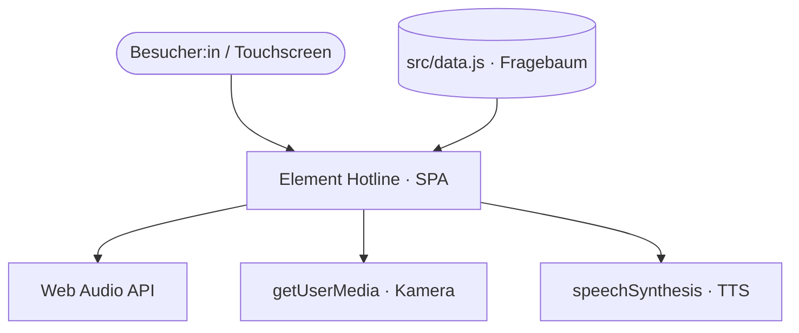
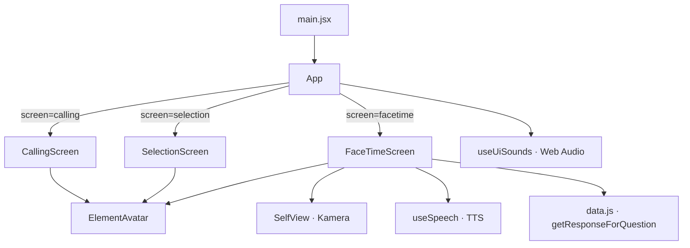

## Kontext

Eine reine Frontend-App ohne Server. Sie spricht nur den Browser und dessen
Web-APIs an; alle Inhalte sind im Bundle enthalten.

## Container / Module

Es gibt genau einen Deployment-Artefakt: das statische Vite-Bundle. Innerhalb
davon strukturiert `App.jsx` die UI in Screen-Komponenten, die eine zentrale
Zustandsmaschine umschaltet.

## Zustandsmaschine der Screens

`App` hält `screen` (`selection` → `calling` → `facetime`) und die gewählte
`persona`. Der Übergang von `calling` nach `facetime` läuft per Timeout (≈2,2 s
Klingeln); `useUiSounds` reagiert auf den Wechsel und spielt Klingel-/Verbindungs-
Sounds. Auflegen setzt `screen` zurück auf `selection`. Details als Sequenz:
siehe [Workflows](#workflows).

## Schlüsselentscheidungen

Das *Warum* steht in den [Architekturentscheidungen](#adrs):

- Kein Backend, statische In-App-Daten — ADR-001.
- Persona-spezifischer Fragebaum mit `unlocks` statt flacher Liste — ADR-002.
- Browser-`speechSynthesis` als optionales, abschaltbares TTS — ADR-003.
- Fluides, gerätegnostisches Layout statt Fix-auf-1920×1080 — ADR-004.
