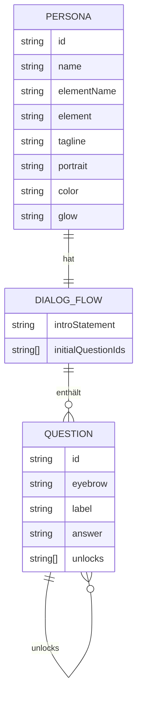

Es gibt keine Datenbank. „Daten" meint hier die statischen Strukturen in
`src/data.js`, die das Erlebnis steuern. `src/dialog-overview.json` ist eine
separate, redaktionelle Review-Sicht derselben Inhalte (kein Laufzeit-Import).

## Entitäten & Beziehungen

## Felder im Detail

**`PERSONA`** (Array `PERSONAS`) — Stammdaten und Look eines Elements: `id`,
`name` (personifiziert, z. B. „Goldina"), `elementName` (echter Elementname,
z. B. „Gold" — im Call-Header sichtbar, damit klar wird, *welches* Element
spricht), `element` (Symbol · Ordnungszahl, z. B. „Au · 79"), `tagline`,
`portrait` (Kürzel im Avatar) sowie Farbwerte (`color`, `colorLight`, `glow`,
`ink`, `bg`), die als CSS-Custom-Properties in den Avatar und die
Screen-Hintergründe fließen.

**`DIALOG_FLOW`** (Objekt `DIALOG_FLOWS`, key = persona-`id`):
- `introStatement` — erster Text beim Start des Calls.
- `initialQuestionIds` — Fragen, die sofort sichtbar sind.
- `questions[id]` — Map aller Fragen der Persona.

**`QUESTION`** — `eyebrow` (Kategorie-Label über der Frage), `label` (Fragetext),
`answer` (Antworttext), `unlocks` (IDs neuer Fragen, die nach dieser Antwort
erscheinen).

## Regeln & Hinweise

- **Fragebaum, kein DAG-Zwang:** `unlocks` werden additiv in die Liste sichtbarer
  IDs gemergt; Duplikate werden vermieden. Mehrere Fragen dürfen dieselbe
  Folgefrage freischalten.
- **Frage-IDs sind nur innerhalb einer Persona eindeutig** (beide nutzen
  `q1…q6`). IDs nie über Personas hinweg referenzieren.
- **Zugriff ausschließlich über die Helfer** in `data.js`
  (`getPersonaIntro`, `getInitialQuestions`, `getVisibleQuestions`,
  `getResponseForQuestion`) — nicht direkt auf `DIALOG_FLOWS` zugreifen.
- **`getResponseForQuestion` ist absichtlich asynchron** (≈720 ms Timeout), um
  Antwortlatenz zu simulieren und die Tipp-Animation zu zeigen. Das ist die
  Naht, an der später eine echte Datenquelle/LLM andocken kann.
- **Redaktionssicht synchron halten:** Ändern sich Fragen/Antworten, sollte
  `dialog-overview.json` mitgezogen werden (Review-Artefakt, kein Build-Input).
