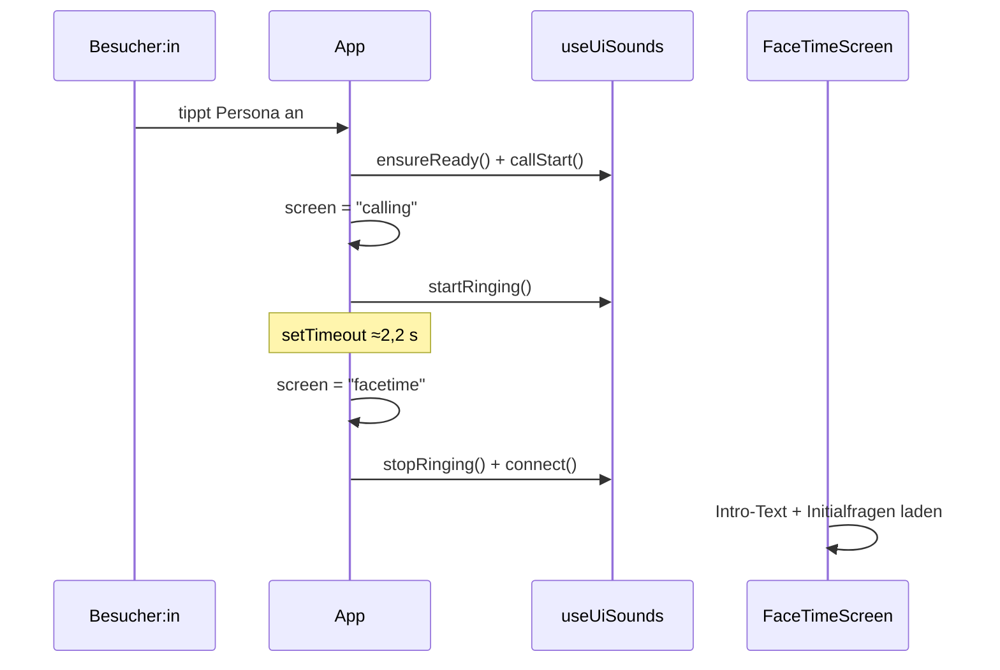
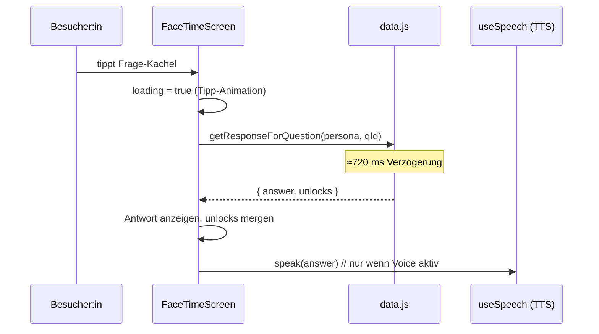

## Anruf starten (Selection → FaceTime)

Vom Antippen einer Persona bis zum verbundenen FaceTime-Screen, inklusive der
Sound-Übergänge.

## Frage beantworten & Folgefragen freischalten

Der Kern der Interaktion: Auswahl → (simulierte) Latenz → Antwort → neue Fragen.

## Auflegen

Der Auflegen-Button stoppt laufende Sprachausgabe (`stopSpeech`), spielt den
Hangup-Sound und setzt `screen` zurück auf `selection`; `persona` wird geleert.
Der Klingel-Timer wird über den Screen-Wechsel in `useUiSounds` gestoppt.
